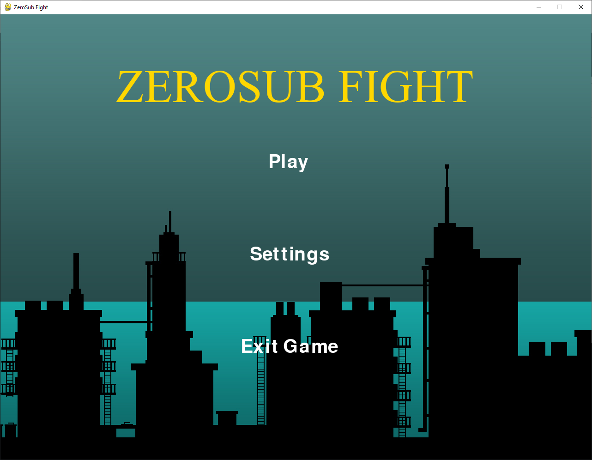
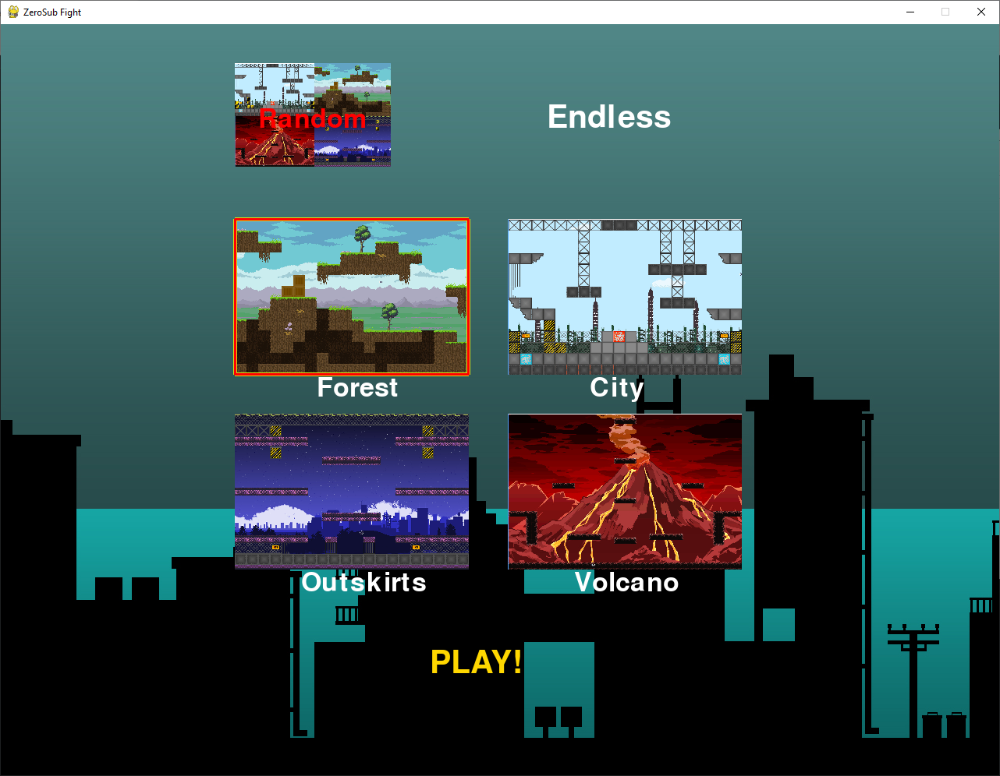
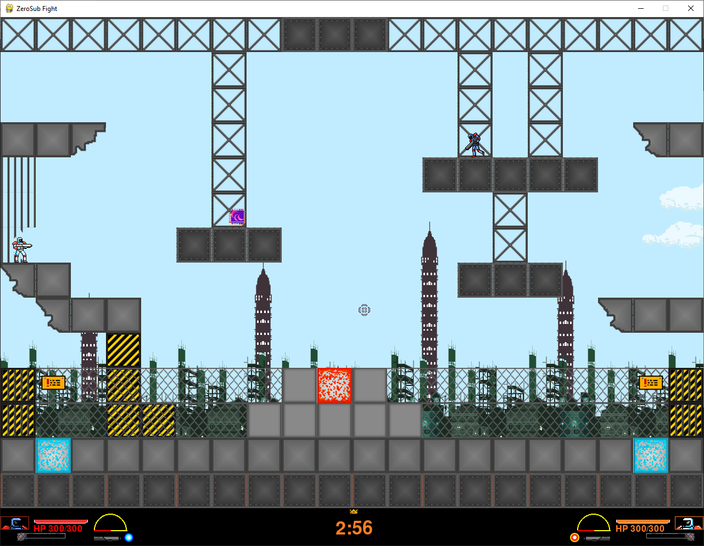

This is an old python project, done both as a personal project and as my project for my Programming class as a freshman in University, back in early 2019.  

To execute, simply make sure you have the required modules (`pygame` should be enough).
And run ZeroSubFight executable.

The code itself is unorganized, no code styling, but at least I splitted it into some different kind of files. I didn't know source control or git was a thing, so I just kept coding and performing backups of the project via mail. All the assets were taken from freesources like [Open Game Art](https://opengameart.org/) and others.

There are probably many bugs and errors in the code, which I clearly don't intend to fix.
The game itself is a 1v1 game, intented to be played with two controllers plugged in.

Has multiple maps 

And features a super cool looking bottom bar UI (lol).

It also features, different weapons, and a grenade ability. (Although one weapon doesn't show up despite being in the game code, because it crashes the game)

The game itself, is actually playable, simply plug in 2 controllers (and with luck!) you should be able to run it.

I'm simply uploading this because I'm actually quite proud of how I accomplished such a game only starting programming a 2-4 months from the making of the game. Also, to remember how fun it was coding my first game (and also first big project)!. And I would like to keep the code to simply look back and even see how far I have improved. 

Feel free to use this in any way you like, if you can find this code useful.